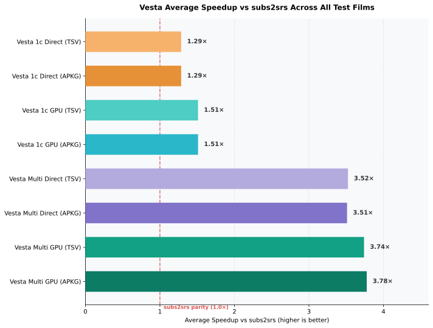
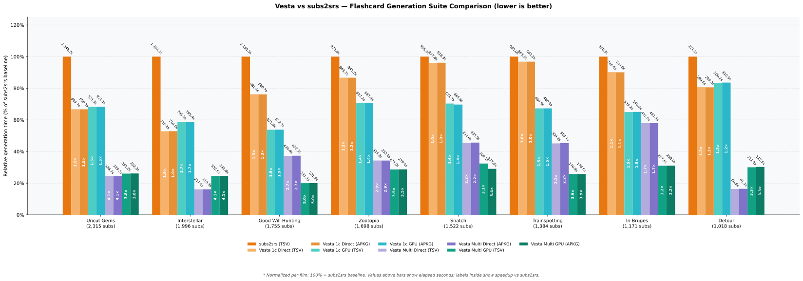

#  Vesta

> [!WARNING]
> **Work in Progress**: This README is currently temporary and a work in progress (WIP), is subject to ongoing reorganization, and will be further refined and expanded.

**Contents:** [Overview](#what-it-does) · [Features](#core-features) · [Architecture & CLI](#modular-architecture--headless-cli-use) · [Build](#building-from-source) · [Benchmarks](#benchmarks) · [Documentation](#documentation-map)

**subs2srs, but faster and with more features**

Vesta is a modernized spiritual son of subs2srs. 
A desktop application for language learners that turns video/audio files and subtitle files into flashcard decks for anki, allows you to fix desynced subtitles, add missing translation and more 

## Benchmarks





> Tested across **8 feature-length movies (~12,000+ subtitles)**, Vesta achieves a **~3.5× to 3.8× average speedup** (and up to **6.22× peak speedup**) compared to subs2srs.
>
> Even on a single thread (`1t`), Vesta is **~1.3× to 1.9× faster** than subs2srs due to faster stream seeking and pipe optimizations.
>
> For full test details and reproduction steps, see [**docs/BENCHMARK_STEPS.md**](docs/BENCHMARK_STEPS.md). For per-movie charts and raw data across all 9 variants, see the [**Benchmark Report**](docs/BENCHMARK_REPORT.md).

<details closed>
  <summary><b>Legend & Pipeline Modes</b></summary>

  - **`1t` vs `16t`**: Worker threads.
    - `1t`: Single-thread control matching subs2srs sequential execution 1:1.
    - `16t`: Parallel workers across all 16 CPU threads.
  - **`Direct` vs `GPU`**: Video cutting strategy.
    - `Direct`: Cuts audio and snapshots directly from the source video (same as subs2srs). Best for standard bitrates and files with frequent keyframes.
    - `GPU`: Pre-transcodes video first via GPU hardware acceleration (VA-API), making seeking instant on heavy codecs (like 1080p HEVC).
  - **`TSV` vs `APKG`**: Output format.
    - `TSV`: Raw text cards + media folder (same as subs2srs).
    - `APKG`: Bundles cards, media, and SQLite database into an Anki `.apkg` ready to import.
  - **`subs2srs baseline (1.0×)`**: Original subs2srs runtime. Values above 1.0× mean faster generation (e.g. 3.8× finishes in ~26% of the time).

</details>

## What it does

Set up with your preferences and drop in your media and subtitle files and create your flashcards.

#### What if the timestamps of my srt are not synced with the media?
Go to the **"Synchronize"** tab; here you can add manual anchors and check synchronization step by step.
A few anchors are enough if the SRT timestamps are just offsetted.
If there are many discrepancies, use **Auto-Sync** to automatically realign timestamps with help from Whisper.

#### What if I lack an SRT file in my language?
After setting up your tiers and providers for LLM answers in Settings, go to the **"Translate"** tab and translate your file. Subtitles are translated in context-aware batches, with progress saved incrementally so you can resume at any time.

#### What if I only have a media file and I don't have any SRT file?
Go to the **"Transcribe"** tab. You can generate a new `.srt` file directly from your audio or video file using local **Whisper** (via `whisper.cpp` with optional GPU acceleration) or by using fast cloud STT providers specified by you.

#### What if I want to check any missing subtitle?
Go to the **"Revise"** tab. You can load two subtitle files side-by-side (such as a target language SRT and a reference or native SRT) to inspect them line by line. You can quickly jump to missing or empty subtitles, edit lines directly, insert or remove dialogue, and align timings.

#### What if I want to add notes?
Go to the **"Annotate"** tab. You can load an Anki `.apkg` deck or flashcard collection to enrich your cards with definitions, grammar explanations, and context notes. You can edit notes **manually** for each card with the built-in editor, or generate them **automatically** using LLMs.

#### What are tiers and providers?
Tiers and providers are a form of load-balancing for generative operations:
- **Providers** represent individual endpoints (e.g. a Self-Hosted models, OpenRouter, Google, Groq, Mistral, OpenAI, GitHub Models etc.)
- **Tiers** define priority levels. Within each tier, requests rotate across providers in a round-robin cycle to share the workload while respecting their configured requests per minute and maximum request limits. If all providers in a tier exhaust their rate limits or quotas, Vesta automatically fails over to the next tier without interrupting your process.

#### What do I do if I don't want to use any AI feature?
Turn on the **AI Kill Switch**! 


---

## Core Features

### 1. Flashcards and Anki export

- Generate cards from one subtitle track, or match a study-language track with a reference translation by overlapping timestamps.
- Export a ready-to-import `.apkg`, a TSV file with its media folder, or send the generated package to a running Anki instance through AnkiConnect.
- Add per-card MP3 or Opus audio, WebP/AVIF/JPEG snapshots, or H.264/MPEG-4 clips. Audio track, margins, bitrate, dimensions, crop, and quality remain configurable per episode.
- Normalize clip loudness with EBU R128, combine split sentences, include surrounding dialogue, and filter cards by text or duration.
- Use responsive Anki templates with dark mode and language-specific Noto fonts; required fonts can be embedded in APKG exports.

### 2. Transcription

- Produce SRT files from audio or video with local `whisper.cpp` models or configured cloud STT endpoints.
- Use Silero VAD to exclude non-speech regions before transcription and request word timestamps when the selected backend supports them.
- Local builds can offload Whisper to a compiled GPU backend. Linux release packages enable Vulkan and fall back to CPU when no usable device is available; current Windows packages use CPU.

### 3. Synchronization and review

- Correct a constant offset or gradual drift by placing timing anchors in the synchronization wizard (`srt-sync`).
- Generate speech anchors with Whisper for automatic re-alignment (`srt-autosync`), then review the result before saving.
- Compare two subtitle files side by side, edit text and timings, and jump directly to missing lines in Revise.

### 4. Translation and annotation

- Translate subtitles in overlapping context batches instead of isolated lines, with resumable output.
- Configure ordered provider tiers: endpoints within a tier share requests; the next tier is used when the current one is unavailable or rate-limited.
- Add or edit explanations, grammar notes, and examples in existing APKG or TSV decks with the Refine/Annotate workflow.

### 5. File matching and language defaults

- Drop several media and subtitle files at once; Vesta pairs episodes across common western, anime, Chinese, and Korean naming patterns.
- Classify original and reference tracks from language codes and filename markers, while keeping every match editable.
- Keep separate defaults for native, study, translation-target, transcription, and interface languages.

---

## Modular Architecture & Headless CLI Use

Vesta is organized as a Cargo workspace of decoupled crates. Backend engines live in `lib/` or `core/`; the principal workflows also expose a standalone binary in `cli/`.

```
vesta/
├── core/
│   ├── srt-parser/        # SRT parsing, timing, and formatting engine
│   └── srt-apkg/          # Native Anki package (.apkg) SQLite collection builder
├── lib/
│   ├── srt-flashcards/    # Flashcard generation, media orchestration & filters
│   ├── srt-transcribe/    # Whisper.cpp + Silero VAD + Cloud STT pipeline
│   ├── srt-autosync/      # Automatic Whisper-assisted subtitle synchronization
│   ├── srt-sync/          # Anchor-based timing interpolation
│   ├── srt-translate/     # Multi-tier LLM subtitle translation
│   ├── srt-ankiconnect/   # AnkiConnect API client for direct sync
│   ├── srt-extract/       # Subtitle text and metadata extraction
│   └── srt-refine/        # LLM-powered deck enrichment
├── cli/
│   ├── srt-flashcards-cli # Headless flashcard & deck generation CLI
│   ├── srt-transcribe-cli # Media to SRT transcription CLI
│   ├── srt-autosync-cli   # Subtitle re-sync CLI
│   ├── srt-translate-cli  # Subtitle translation CLI
│   └── srt-extract-cli    # Subtitle data extraction CLI
└── apps/
    ├── srt-gui/           # Desktop GUI (Tauri + Svelte 5 + Tailwind)
    └── whisper-bench/     # Transcription benchmarking tool
```

### CLI Quick Examples

Build only the standalone CLI tool you need:

```bash
# Build the flashcards CLI
cargo build --release -p srt-flashcards-cli

# Generate an Anki .apkg deck from subtitles and video
./target/release/srt-flashcards generate \
  --target episode-ja.srt \
  --native episode-en.srt \
  --video episode.mkv \
  --output ./out_deck \
  --format apkg \
  --deck "Anime Season 1" \
  --snapshot-format webp \
  --audio-format opus
```

For comprehensive module guides and Rust integration examples, see [`docs/modules/README.md`](docs/modules/README.md) and [`docs/ARCHITECTURE.md`](docs/ARCHITECTURE.md).

---

## Documentation Map

- [`docs/ARCHITECTURE.md`](docs/ARCHITECTURE.md) — Architectural design contracts, layering rules, and conventions.
- [`docs/BENCHMARK_STEPS.md`](docs/BENCHMARK_STEPS.md) — Step-by-step benchmark reproduction guide, fairness controls, and subs2srs harness explanation.
- [`docs/BENCHMARK_REPORT.md`](docs/BENCHMARK_REPORT.md) — Full 8-film benchmark results, throughput tables, and per-film charts.
- [`docs/modules/`](docs/modules/) — Detailed module specifications and embedding instructions.

---

## Building from Source

### Prerequisites
- **Rust**: 1.97+ (`rustup default stable`)
- **Node.js**: 20.19+ or 22+ (LTS recommended) and `npm`
- **System dependencies**:
  - **Runtime**: `ffmpeg` and `ffprobe` on your system PATH.
  - **Build (Linux)**: C/C++ compiler (`gcc`/`clang`), `cmake`, `pkg-config`, and Tauri v2 development libraries (`libwebkit2gtk-4.1-dev` or `4.0`, `libappindicator3-dev`, `librsvg2-dev`).

### Development Setup
```bash
# Clone the repository
git clone https://github.com/pierspad/vesta.git
cd vesta

# Install frontend dependencies
cd apps/srt-gui && npm install && cd ../..

# Then either run the GUI in development mode
./run_gui.sh

# Or manually:
cd apps/srt-gui && npx tauri dev
```

---

## Contributing

Pull requests are welcome! For major changes, please open an issue first to discuss your ideas.

If Vesta is useful to you and you want to support its maintenance, you can [sponsor the project on GitHub](https://github.com/sponsors/pierspad). Sponsorship is optional and does not unlock features.

---

## AI Disclosure

This project was developed with the assistance of Large Language Models, used to support code writing and documentation.

---

## License

This project is licensed under the GPL v3 License — see the [LICENSE](LICENSE) file for details.
