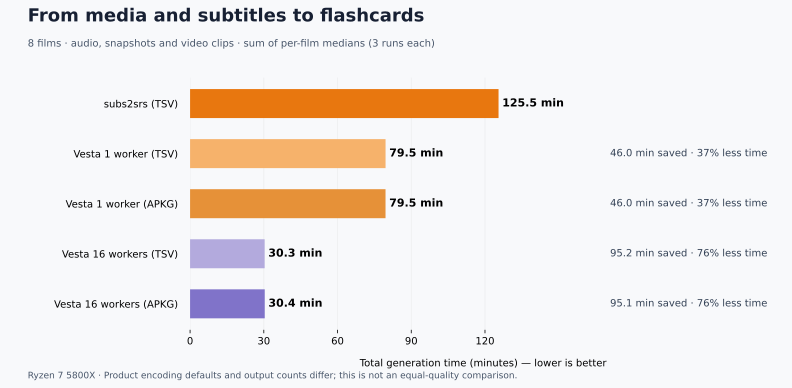

#  Vesta

[](https://github.com/pierspad/vesta/actions/workflows/ci.yml) [](https://github.com/pierspad/vesta/actions/workflows/build.yml) [](https://github.com/pierspad/vesta/releases/latest)

[](https://github.com/sponsors/pierspad) [](https://buymeacoffee.com/pierspad) [](https://ko-fi.com/pierspad)

**Contents:** [Overview](#what-it-does) · [Get started](#get-started) · [Workflow](#the-workflow) · [Benchmarks](#benchmarks) · [Architecture](#how-vesta-was-built) · [CLI](#headless-cli-use) · [Build](#building-from-source) · [Documentation](#documentation-map)

**Turn films, series and audio into Anki decks.**

Vesta is a desktop successor to subs2srs for language learners. Each subtitle becomes a card with dialogue, audio and a snapshot; add a translation or video clip if you want one. Preview and filter cards before exporting to Anki.

[](#benchmarks)

*Eight films: 126 minutes with subs2srs, 30 minutes with Vesta at 16 workers. [Measurement scope and results](#benchmarks).*

## What it does

- **Create decks:** export a ready-to-import APKG, a TSV with media, or send cards to Anki through AnkiConnect.
- **Prepare subtitles:** extract embedded text tracks, correct timing, and compare or edit subtitle files side by side.
- **Fill the gaps:** transcribe missing subtitles, translate dialogue, and add definitions or grammar notes to existing decks.

Deck generation and subtitle editing run locally. Local Whisper transcription is available; cloud transcription and language models are optional. You can disable AI features in Settings with the **AI Kill Switch**.

## Get started

[Download the latest release](https://github.com/pierspad/vesta/releases/latest) for **Windows or Linux**. Linux packages include DEB, RPM, Arch and Flatpak.

1. Complete setup with your native and study languages.
2. Open **Flashcards** and add your media and study-language subtitles. Add native-language subtitles if you have them.
3. Preview the cards, choose what to keep, and export an **APKG**. Open it in Anki to import your deck.

FFmpeg and FFprobe are required for media processing. To automate generation, use the [CLI](#headless-cli-use).

## The workflow

Start with **Flashcards** when your subtitles are ready. The other tabs help with source material that needs work:

| What you need | Where to go |
|---|---|
| Subtitles from a video container | **Extract subtitles** — save embedded text tracks as SRT. Bitmap tracks need OCR. |
| Subtitles for media without a transcript | **Transcribe** — use local Whisper or a configured cloud service. |
| Subtitles that are early, late or drifting | **Synchronize** — set manual anchors or use Whisper-assisted Auto-Sync. |
| A translation in your native language | **Translate** — translate in context-aware batches and resume saved progress. |
| Corrections or a comparison with another track | **Revise** — edit dialogue and timing side by side. |
| Definitions, explanations or extra notes on cards | **Annotate** — edit TSV/APKG notes manually or with a language model. |

For cloud features, configure providers in Settings. Provider tiers let Vesta share requests within a tier and move to the next when limits are reached. You can change languages, formats and interface options after setup.

## Benchmarks

**Eight films, 12,859 input subtitles, audio + snapshots + video clips.** On the benchmark machine, generating ready-to-import decks with 16 workers took **30 minutes instead of 2 hours 6 minutes** for subs2srs: about **95 minutes saved (76% less time)** across the dataset.

Each bar sums the median of three runs for each film. Measurements are from an AMD Ryzen 7 5800X; a worker controls concurrent media jobs, not CPU affinity. The TSV rows compare the same export type; APKG includes packaging for direct import into Anki.

The tools use different encoding defaults and produce different media counts, so this is a practical runtime comparison, not an equal-quality test. Separately, **480 native A/B generations** verified the new snapshot batching technique: **15.3% less full-film generation time with identical media and note fields** for audio + snapshots + APKG, without video clips.

[Full results and per-film charts](docs/BENCHMARK_REPORT.md) · [Native A/B evidence](docs/BENCHMARK_NATIVE.md) · [Run the benchmarks](docs/BENCHMARK_STEPS.md)

## How Vesta was built

Vesta uses **Rust** for subtitle and media processing, and **Tauri 2 + Svelte 5** for the desktop interface. The GUI and standalone CLIs share the same engines; deck generation does not require Anki to be running.

| Directory | Responsibility |
|---|---|
| `core/` | SRT parsing and native Anki package creation |
| `lib/` | Flashcards, transcription, synchronization, translation and deck annotation |
| `cli/` | Command-line entry points for the reusable engines |
| `apps/srt-gui/` | Desktop interface and native commands |

FFmpeg handles media extraction. whisper.cpp provides local transcription with optional GPU acceleration and CPU fallback. Long-running operations report progress and support cancellation.

See [the architecture guide](docs/ARCHITECTURE.md) for design decisions and [module documentation](docs/modules/README.md) for Rust integration examples.

## Headless CLI Use

Build the flashcard CLI and generate a deck:

```bash
cargo build --release -p srt-flashcards-cli

./target/release/srt-flashcards generate \
  --target episode-ja.srt \
  --native episode-en.srt \
  --video episode.mkv \
  --output ./out_deck \
  --format apkg \
  --deck "Japanese — Episode 1" \
  --snapshot-format webp \
  --audio-format opus
```

The native subtitle track is optional. Run `./target/release/srt-flashcards generate --help` for filters and media options. Other CLIs cover transcription, synchronization, translation and subtitle extraction; see [the module guides](docs/modules/README.md).

## Building from Source

You need **Rust 1.97+**, **Node.js 22.12+**, npm, FFmpeg and FFprobe. Linux desktop builds also need a C/C++ compiler, CMake, pkg-config and Tauri development libraries (`libwebkit2gtk-4.1-dev`, `libappindicator3-dev`, `librsvg2-dev`). Native Whisper builds may need additional GPU tooling; see [transcription build requirements](docs/modules/srt-transcribe.md).

```bash
git clone https://github.com/pierspad/vesta.git
cd vesta/apps/srt-gui
npm ci
npx tauri dev
```

For tests and release checks, see [CONTRIBUTING.md](CONTRIBUTING.md) and [the quality guide](docs/QUALITY.md).

## Documentation Map

- [Architecture](docs/ARCHITECTURE.md) — engine boundaries, desktop integration and media lifecycle.
- [Modules](docs/modules/README.md) — CLI usage and embedding the Rust engines.
- [Quality](docs/QUALITY.md) — automated checks and installed-app validation.
- [Benchmarks](docs/BENCHMARK_STEPS.md) — reproduce the measurements and understand their scope.

## Contributing

Bug reports and pull requests are welcome. For major changes, open an issue first. See [CONTRIBUTING.md](CONTRIBUTING.md).

## LLM Disclosure

This project was developed with the assistance of Large Language Models, used to support code writing and documentation.

## License

Vesta is licensed under the [GNU General Public License v3](LICENSE).
