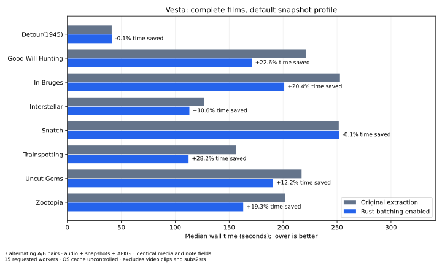
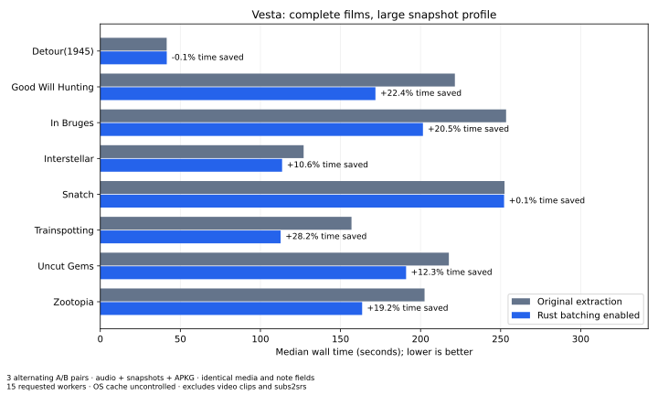

# Native Rust snapshot batching — 2026-10-07

This A/B suite isolates batching in the shared desktop/CLI engine. The same
release binary runs with `--no-optimize` and with defaults, direct FFmpeg,
15 requested workers, normalized MP3 128k/44.1kHz/stereo and WebP quality 80.
There are no video clips or full-film intermediate transcodes in this suite.

Eight films, 25/100/300/all-card nearby cases and 100 sparse cards, two output
sizes (256×144 and 640×360), three alternating A/B pairs: **480 generations**.
All 240 pairs passed ZIP/SQLite/count/reference checks. **409,416 media-file
validations** had exact media hashes and identical note fields across each
case's six runs. The matrix took 6 h 5 min of generation time.

## Results

On complete-film cases, summing all three measured baseline and optimized runs
across the eight films gives **15.27% less time at 256×144** and **15.28% at
640×360**. These are reductions in elapsed time, not percentage increases in
throughput. Per-film median reductions at 256×144:

| Film | Baseline | Optimized | Time saved |
|---|---:|---:|---:|
| Detour | 41.098 s | 41.153 s | −0.1% |
| Good Will Hunting | 220.937 s | 171.078 s | 22.6% |
| In Bruges | 252.688 s | 201.049 s | 20.4% |
| Interstellar | 126.575 s | 113.101 s | 10.6% |
| Snatch | 251.586 s | 251.814 s | −0.1% |
| Trainspotting | 156.533 s | 112.346 s | 28.2% |
| Uncut Gems | 217.133 s | 190.618 s | 12.2% |
| Zootopia | 201.917 s | 163.013 s | 19.3% |

Detour is below the resolution threshold; Snatch does not meet the conservative
CFR check. They retain individual extraction and show effectively unchanged
full-film times. Sparse requests are also effectively unchanged; the shortest
Detour samples show about 0.06 s overhead. OS cache is uncontrolled, order
alternates, RSS/processes are sampled every 20 ms and may miss short peaks.
These measurements do not cover all hardware, codecs, image formats, clips or
GUI operations, and do not promise an improvement for every input.

## Evidence and reproduction

- [All 480 timings](benchmarks/native-snapshots-2026-10-07.csv).
- [Build/tool/settings metadata and raw-result digest](benchmarks/native-snapshots-2026-10-07.json).
- [Runner, options and quality checks](../benchmarking/snapshot_batch/README.md).

The original raw JSON with every media hash is retained outside the repository;
its digest is recorded in metadata. Python is only the measurement/validation
harness. The optimization itself is Rust, implemented in `snapshot_batch.rs`.
Keep this suite separate from the [product-default subs2srs comparison](BENCHMARK_REPORT.md).
