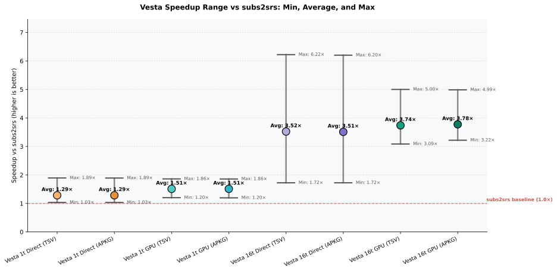
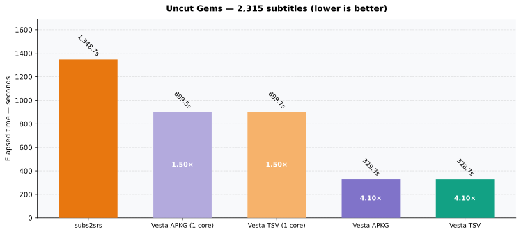
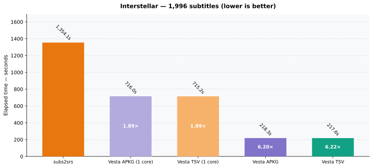
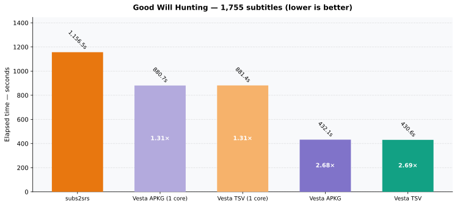
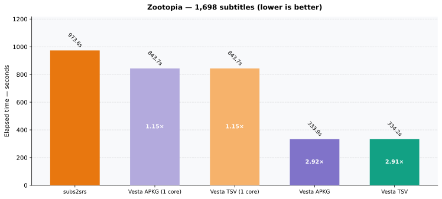
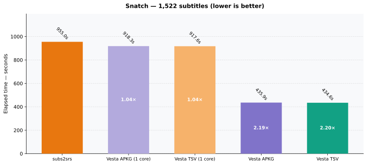
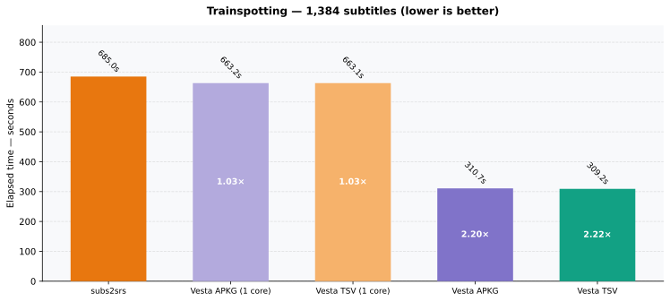
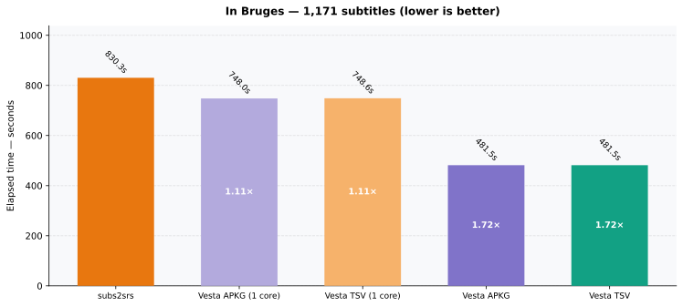
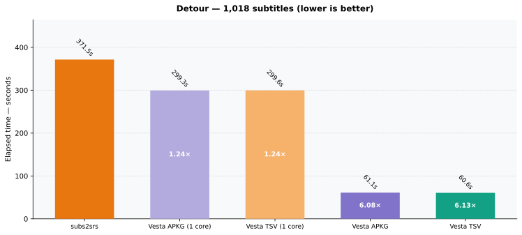

# Vesta vs subs2srs — Comprehensive Benchmark Report

### System & Hardware Specifications
- **CPU**: AMD Ryzen 7 5800X 8-Core Processor (16 logical cores)
- **GPU**: Advanced Micro Devices, Inc. [AMD/ATI] Navi 32 [Radeon RX 7700 XT / 7800 XT] (rev c8)
- **Pipeline Modes Tested**:
  - **Direct (No Transcode)**: Direct stream cutting without pre-transcoding (identical methodology to subs2srs).
  - **GPU Pre-Transcoding**: VA-API hardware acceleration generating intermediate scale stream in ~1-2 min.
- **Formats Tested**: Raw TSV + media folder vs self-contained Anki `.apkg` packages.
- **Worker Configurations**: 1-worker (single core control matching subs2srs) vs Multi-core (all logical cores).

## Charts Overview

### 1. Suite Comparison (All Films & Variants)

### 2. Average Speedup vs subs2srs

### 3. Speedup Range (Min, Average, Max)

## Aggregate Performance Summary

| Series | Total Wall-Clock Time | Overall Speed-up | Avg Film Speed-up | Min Speed-up | Max Speed-up |
|---|---:|---:|---:|---:|---:|
| **subs2srs (TSV)** | 130.7 min | — (baseline) | — | — | — |
| **Vesta 1c Direct (TSV)** | 92.9 min | **1.41×** | **1.43×** | 1.08× | 2.17× |
| **Vesta 1c Direct (APKG)** | 93.0 min | **1.41×** | **1.43×** | 1.08× | 2.16× |
| **Vesta Multi Direct (TSV)** | 48.2 min | **2.71×** | **3.43×** | 1.56× | 7.11× |
| **Vesta Multi Direct (APKG)** | 48.1 min | **2.71×** | **3.44×** | 1.56× | 7.17× |
| **Vesta Multi GPU (TSV)** | 35.0 min | **3.73×** | **3.74×** | 3.23× | 5.17× |

## Per-Film Detailed Results

| Film | Subtitles | Series | Time | Cards/min | Speed-up vs subs2srs |
|---|---:|---|---:|---:|---:|
| Uncut Gems | 2,315 | subs2srs (TSV) | 1,348.5 s | 103 | — |
| Uncut Gems | 2,315 | Vesta 1c Direct (TSV) | 835.6 s | 166 | **1.61×** |
| Uncut Gems | 2,315 | Vesta 1c Direct (APKG) | 838.0 s | 166 | **1.61×** |
| Uncut Gems | 2,315 | Vesta Multi Direct (TSV) | 359.0 s | 387 | **3.76×** |
| Uncut Gems | 2,315 | Vesta Multi Direct (APKG) | 359.1 s | 387 | **3.76×** |
| Uncut Gems | 2,315 | Vesta Multi GPU (TSV) | 368.6 s | 377 | **3.66×** |
| Interstellar | 1,996 | subs2srs (TSV) | 1,406.6 s | 85 | — |
| Interstellar | 1,996 | Vesta 1c Direct (TSV) | 649.4 s | 184 | **2.17×** |
| Interstellar | 1,996 | Vesta 1c Direct (APKG) | 650.3 s | 184 | **2.16×** |
| Interstellar | 1,996 | Vesta Multi Direct (TSV) | 236.6 s | 506 | **5.94×** |
| Interstellar | 1,996 | Vesta Multi Direct (APKG) | 236.5 s | 506 | **5.95×** |
| Interstellar | 1,996 | Vesta Multi GPU (TSV) | 353.6 s | 339 | **3.98×** |
| Good Will Hunting | 1,755 | subs2srs (TSV) | 1,212.8 s | 87 | — |
| Good Will Hunting | 1,755 | Vesta 1c Direct (TSV) | 828.9 s | 127 | **1.46×** |
| Good Will Hunting | 1,755 | Vesta 1c Direct (APKG) | 831.0 s | 127 | **1.46×** |
| Good Will Hunting | 1,755 | Vesta Multi Direct (TSV) | 494.3 s | 213 | **2.45×** |
| Good Will Hunting | 1,755 | Vesta Multi Direct (APKG) | 493.8 s | 213 | **2.46×** |
| Good Will Hunting | 1,755 | Vesta Multi GPU (TSV) | 234.8 s | 449 | **5.17×** |
| Zootopia | 1,698 | subs2srs (TSV) | 968.9 s | 105 | — |
| Zootopia | 1,698 | Vesta 1c Direct (TSV) | 783.5 s | 130 | **1.24×** |
| Zootopia | 1,698 | Vesta 1c Direct (APKG) | 783.7 s | 130 | **1.24×** |
| Zootopia | 1,698 | Vesta Multi Direct (TSV) | 369.4 s | 276 | **2.62×** |
| Zootopia | 1,698 | Vesta Multi Direct (APKG) | 365.8 s | 279 | **2.65×** |
| Zootopia | 1,698 | Vesta Multi GPU (TSV) | 291.9 s | 349 | **3.32×** |
| Snatch | 1,522 | subs2srs (TSV) | 950.0 s | 96 | — |
| Snatch | 1,522 | Vesta 1c Direct (TSV) | 880.8 s | 104 | **1.08×** |
| Snatch | 1,522 | Vesta 1c Direct (APKG) | 877.0 s | 104 | **1.08×** |
| Snatch | 1,522 | Vesta Multi Direct (TSV) | 495.3 s | 184 | **1.92×** |
| Snatch | 1,522 | Vesta Multi Direct (APKG) | 494.8 s | 185 | **1.92×** |
| Snatch | 1,522 | Vesta Multi GPU (TSV) | 288.6 s | 316 | **3.29×** |
| Trainspotting | 1,384 | subs2srs (TSV) | 722.1 s | 115 | — |
| Trainspotting | 1,384 | Vesta 1c Direct (TSV) | 624.6 s | 133 | **1.16×** |
| Trainspotting | 1,384 | Vesta 1c Direct (APKG) | 624.8 s | 133 | **1.16×** |
| Trainspotting | 1,384 | Vesta Multi Direct (TSV) | 352.2 s | 236 | **2.05×** |
| Trainspotting | 1,384 | Vesta Multi Direct (APKG) | 352.3 s | 236 | **2.05×** |
| Trainspotting | 1,384 | Vesta Multi GPU (TSV) | 190.3 s | 436 | **3.79×** |
| In Bruges | 1,171 | subs2srs (TSV) | 827.4 s | 85 | — |
| In Bruges | 1,171 | Vesta 1c Direct (TSV) | 708.5 s | 99 | **1.17×** |
| In Bruges | 1,171 | Vesta 1c Direct (APKG) | 709.6 s | 99 | **1.17×** |
| In Bruges | 1,171 | Vesta Multi Direct (TSV) | 531.0 s | 132 | **1.56×** |
| In Bruges | 1,171 | Vesta Multi Direct (APKG) | 529.7 s | 133 | **1.56×** |
| In Bruges | 1,171 | Vesta Multi GPU (TSV) | 256.5 s | 274 | **3.23×** |
| Detour | 1,018 | subs2srs (TSV) | 403.3 s | 151 | — |
| Detour | 1,018 | Vesta 1c Direct (TSV) | 260.2 s | 235 | **1.55×** |
| Detour | 1,018 | Vesta 1c Direct (APKG) | 262.8 s | 232 | **1.53×** |
| Detour | 1,018 | Vesta Multi Direct (TSV) | 56.7 s | 1,077 | **7.11×** |
| Detour | 1,018 | Vesta Multi Direct (APKG) | 56.3 s | 1,085 | **7.17×** |
| Detour | 1,018 | Vesta Multi GPU (TSV) | 116.5 s | 524 | **3.46×** |

## Per-Film Charts

### Uncut Gems

### Interstellar

### Good Will Hunting

### Zootopia

### Snatch

### Trainspotting

### In Bruges

### Detour

